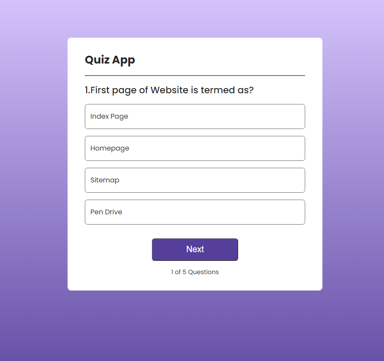
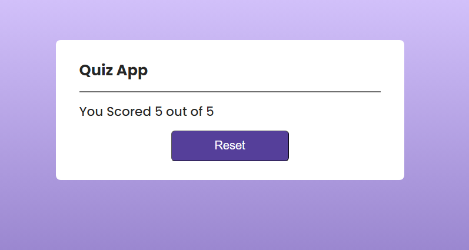

# Quiz App

This is a simple quiz application built using HTML, CSS, and React.js. It provides an interactive platform for users to take quizzes on various topics.

This template provides a minimal setup to get React working in Vite with HMR and some ESLint rules.

## Features

- Five multiple-choice questions
- Score tracking
- Ability to reset and play again

## How to Play

1. Answer the five questions provided.
2. After answering all questions, your score will be displayed.
3. To play again, simply click the "Reset" button.

## Installation

1. Clone this repository to your local machine.
2. Navigate to the project directory.
3. Run `npm install` to install dependencies.
4. Run `npm run dev` to start the development server.
5. Open your browser and navigate to the local host.

## Contributing

Contributions are welcome! If you find any bugs or have suggestions for improvement, please open an issue or submit a pull request.

## License

This project is licensed under the MIT License. See the [LICENSE](LICENSE) file for details.
